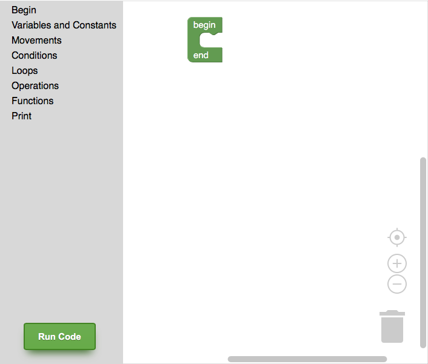
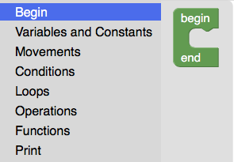
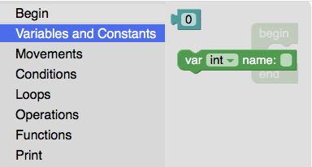
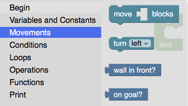
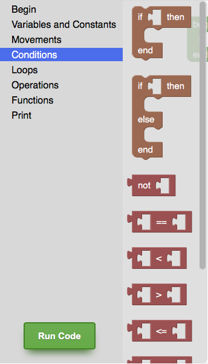
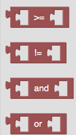
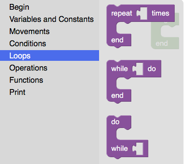
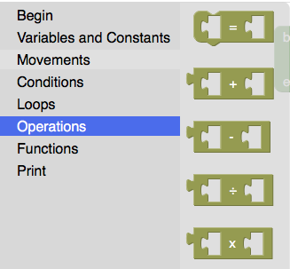
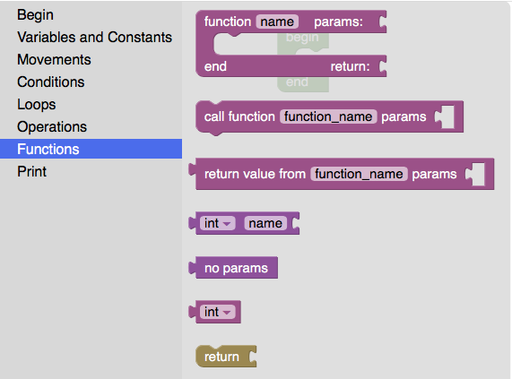
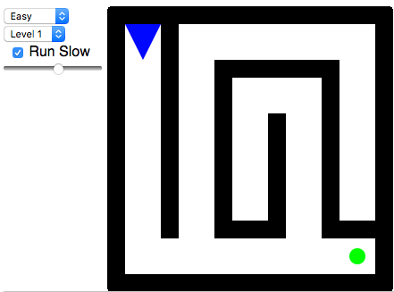

# Doodle Doodle Getting Started
This is a graphic input programming language developed using Google's Blockly library to help people learn the basics of programming

## Workspace

The workspace is where you will _write_ your code dragging blocks from the sidebar into the white area.

### Blocks
#### Begin-End

The Begin-End block serves as the _main_ section of your program. This is the starting point of the execution, there can only be one of these blocks.

#### Variables & Constants

The block  serves the purpose of accessing variables and using constants. For example you can set it to a specific number just type any number `7`, you can set it to a string using quotes `"hello world"`, or to a boolean using `true` or `false`.

The second block is for initializing variables, you can click on the dropdown to choose from the options `int|float|string|boolean` and set the name of your variable.

The variables you define inside the Begin-End block are global variables, meaning you can access them anywhere. The variables defined inside functions are local to that function only. If a local variable is named the same as a global variable, the local variable will be used when in that specific function.

#### Movements

These blocks are specifically designed to work with the maze.
The `move c[] blocks` block moves the  the amount of blocks you want, in the `c[]` space you can specify any number.

The `turn` block turns 90º to the left or to the right, you can choose the direction in the dropdown.

The `wall in fron?` block returns a boolean, telling you if there's a wall in front or not.

The `on goal?` block tells you if you have reached the goal  or not.

#### Conditions

These blocks are the conditional blocks, the `If` works by executing the inside of the block if a certain condition is met. The `If/Else` block works the same but adds another space for when the condition is not met.

The rest of the red blocks help you make this conditions.

#### Loops

The `repeat` block cycles a certain amount of times. The `while` block cycles while a certain condition remains true, the difference with the `do while` loop is that the first time it loops, the `while` condition must be true and in the `do while` it will enter first then compare this condition.

#### Operations

These blocks are the mathematical operations.

#### Functions

These blocks serve the purpose of creating and calling functions.
The first block let's you create a function where you can specify the name, parameters, and return value. To specify the parameters you can use the  or if you don't need parameters the  block.
You must always specify a return value using the  the available options are `int|float|string|boolean|no return`.

If your function does not have a return value you can use the `call function` block. But if your function does have a return value you must use the `return value from` function, and your function definition must have at least 1  block.

#### Print
The `print` block will output the expression into the Shell.

The `say` block will output the expression into an alert message on the browser.

## Running the code
To run your code just click the  button. This will start the execution of the Begin-End block, you can control the speed of the execution using the controls to the side of the maze.  with the checkbox on the code will run slower depending on the slider below, the more the the right the slower the code will run. If you wish that your code executes immediately uncheck the `Run Slow` checkbox.
When running slow your code you can stop the execution by clicking the  button.

## Maze

The maze objective is to reach the  starting from the . You can go step by step or implement an intelligent algorithm. There are 3 difficulties `easy`, `medium`, and `hard` each difficulty has 2 levels.

## Samples
- [Factorial](http://andywarrior.github.io/Doodle-Doodle/factorial.html) recursive and iterative implementation.
- [Fibonacci](http://andywarrior.github.io/Doodle-Doodle/fibonacci.html) recursive and iterative implementation.
- [isPrime](http://andywarrior.github.io/Doodle-Doodle/is-prime.html) implementation.
- [Maze Algorithm](http://andywarrior.github.io/Doodle-Doodle/maze-algorithm.html) implementation of an algorithm that solves every maze on Doodle-Doodle.

## Authors
- [AndyWarrior](https://github.com/AndyWarrior)
- [acrogenesis](https://github.com/acrogenesis)

## License

Code released under the MIT License.
